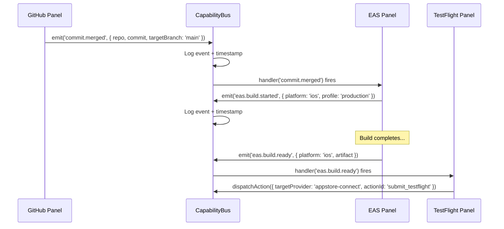
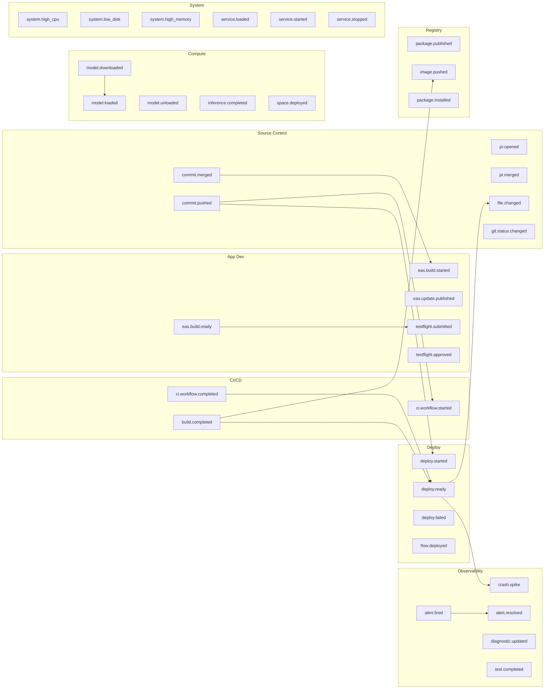

# Anti-Miswiring Plugin Extensions Architecture

> **Invariance Guarantee**: Adding integration N+1 changes exactly ZERO lines in integrations 1..N.

This document specifies the Integration Provider system, CapabilityBus, and panel workflow architecture built into the admin.contextdna.io IDE. It is written as an anti-miswiring specification — every contract, boundary, and data flow is defined such that incorrect wiring is caught at compile time, not at runtime.

---

## Table of Contents

1. [Philosophy & Invariance Principles](#1-philosophy--invariance-principles)
2. [Provider Manifest Specification](#2-provider-manifest-specification)
3. [CapabilityBus Architecture](#3-capabilitybus-architecture)
4. [Workflow Chains (Panel-to-Panel Integration)](#4-workflow-chains-panel-to-panel-integration)
5. [Suggested Panel Groups](#5-suggested-panel-groups)
6. [Smart Recognizer](#6-smart-recognizer)
7. [Provider Implementation Guide](#7-provider-implementation-guide)
8. [Invariance Guarantees](#8-invariance-guarantees)
9. [MCP Compatibility Layer (Future)](#9-mcp-compatibility-layer-future)
10. [Safety & Consent Model](#10-safety--consent-model)
11. [Eval-First Engineering](#11-eval-first-engineering)
12. [License Audit & Compliance](#12-license-audit--compliance)
13. [Integration Code Patterns (Per Provider)](#13-integration-code-patterns-per-provider) — 20 providers (13.1–13.21) + auth summary (13.22)

---

## 1. Philosophy & Invariance Principles

### The Core Problem

Plugin architectures fail in one of three ways:

1. **Coupling creep** — Provider A imports Provider B, creating hidden dependency chains
2. **Event spaghetti** — Untyped string events where a typo causes silent failure
3. **Contract drift** — Provider X implements 80% of the interface, fails on the 20% path nobody tested

### The Anti-Miswiring Solution

Every integration MUST implement `IntegrationProvider`. This is not a guideline — it is enforced by TypeScript's structural type system. A provider that omits `checkAuth()` does not compile. A provider that emits an event not in `CapabilityEvents` does not compile.

```
                    +-----------------------+
                    | IntegrationProvider   |  <-- THE CONTRACT
                    +-----------------------+
                    | id, name, icon        |
                    | category              |
                    | auth: AuthStrategy    |
                    | panels: string[]      |
                    | actions: Action[]     |
                    | emits: EventType[]    |
                    | subscribesTo: Event[] |
                    | checkAuth()           |
                    | listResources()       |
                    | getResource()         |
                    | executeAction()       |
                    | startEventSource?()   |
                    | initialize?()         |
                    | dispose?()            |
                    +-----------------------+
                           |
          +----------------+----------------+
          |                |                |
     +--------+      +--------+      +--------+
     | EAS    |      | Vercel |      | Sentry |  ... 20 providers
     +--------+      +--------+      +--------+
```

### Three Laws

1. **Contract-first**: The `IntegrationProvider` interface is the single source of truth. Type safety enforces correctness at compile time.
2. **Additive-only**: Adding a new provider is a file addition + one line in `ALL_PROVIDERS`. No existing code changes.
3. **Opt-in subscriptions**: No provider is forced to handle events. `subscribesTo: []` is valid and common.

---

## 2. Provider Manifest Specification

### 2.1 The IntegrationProvider Contract

Source: `lib/ide/integration-manifest.ts`

```typescript
export interface IntegrationProvider {
  // -- Identity --
  id: string;                        // Unique identifier (e.g., 'eas', 'vercel')
  name: string;                      // Human-readable name
  icon: string;                      // Lucide icon name (e.g., 'Smartphone')
  category: IntegrationCategory;     // Classification bucket
  description: string;               // One-line summary

  // -- Auth --
  auth: AuthStrategy;
  checkAuth(): Promise<{ ok: boolean; error?: string }>;

  // -- Panels --
  panels: string[];                  // Panel IDs this provider contributes

  // -- Resources (read-only CRUD) --
  listResources(type: string, query?: string, limit?: number): Promise<IntegrationResource[]>;
  getResource(type: string, id: string): Promise<IntegrationResource | null>;

  // -- Actions (side-effectful operations) --
  actions: IntegrationAction[];
  executeAction(actionId: string, params: Record<string, unknown>): Promise<{
    ok: boolean;
    result?: unknown;
    error?: string;
  }>;

  // -- Events --
  emits: CapabilityEventType[];      // Events this provider can produce
  subscribesTo: CapabilityEventType[]; // Events this provider reacts to
  startEventSource?(): Disposable;   // Start polling/webhook listener

  // -- Lifecycle --
  initialize?(): Promise<void>;      // Called once on registration
  dispose?(): void;                  // Called on deregistration
}
```

Every field is mandatory except those marked with `?`. Optional lifecycle methods allow providers to set up persistent connections (`initialize`) and tear them down (`dispose`), and optional event sources (`startEventSource`) enable real-time polling or webhook listeners.

### 2.2 Integration Categories

```typescript
type IntegrationCategory =
  | 'registry'       // Docker Hub, npm, PyPI, GHCR
  | 'compute'        // Ollama, StackBlitz, CodeSandbox
  | 'deploy'         // Vercel, Fly.io, AWS
  | 'appdev'         // EAS, App Store Connect, TestFlight
  | 'ml'             // HuggingFace, Kaggle, W&B, MLflow
  | 'ci'             // GitHub Actions, CircleCI, Buildkite
  | 'observability'  // Sentry, Datadog, Grafana
  | 'project'        // Linear, Jira, PagerDuty
  | 'vcs'            // GitHub, GitLab, Bitbucket
  | 'testing'        // API Tester, Cypress, Playwright
  | 'preview';       // Frontend Preview, Browser DevTools
```

Categories serve two purposes: (1) UI grouping in the integration marketplace panel, and (2) workflow preset filtering. A provider belongs to exactly one category.

### 2.3 Auth Strategies

Five auth strategies cover every integration pattern:

| Strategy | Type Signature | Use Case | Example Provider |
|----------|---------------|----------|------------------|
| **api_key** | `{ type: 'api_key'; envKey: string; headerName?: string }` | Bearer token from env | Vercel (`VERCEL_TOKEN`), Sentry (`SENTRY_AUTH_TOKEN`) |
| **oauth** | `{ type: 'oauth'; provider: string; scopes: string[] }` | OAuth2 flow with scopes | Future: GitHub (with fine-grained scopes) |
| **jwt** | `{ type: 'jwt'; issuer: string; keyFile?: string }` | Self-signed JWT from key file | App Store Connect (`.p8` key) |
| **local_socket** | `{ type: 'local_socket'; socketPath: string }` | Local process on known port | Ollama (`http://127.0.0.1:11434`) |
| **none** | `{ type: 'none' }` | No auth required | StackBlitz (anonymous sandboxes) |

#### Auth Contract

Every provider MUST implement `checkAuth()`:

```typescript
// api_key example (Vercel)
async checkAuth() {
  const res = await fetch('https://api.vercel.com/v2/user', {
    headers: { Authorization: `Bearer ${process.env.VERCEL_TOKEN ?? ''}` },
  });
  return res.ok ? { ok: true } : { ok: false, error: `HTTP ${res.status}` };
}

// local_socket example (Ollama)
async checkAuth() {
  const res = await fetch('http://127.0.0.1:11434/api/version');
  return res.ok
    ? { ok: true }
    : { ok: false, error: `Ollama not reachable: HTTP ${res.status}` };
}

// none example (StackBlitz)
async checkAuth() {
  return { ok: true };
}
```

`checkAuth()` MUST be side-effect free. It verifies credentials, not modifies state.

### 2.4 Resource Model

Resources are read-only typed data objects:

```typescript
interface IntegrationResource<T = unknown> {
  id: string;              // Unique identifier within type
  type: string;            // Resource type (e.g., 'builds', 'deployments')
  label: string;           // Human-readable label
  data: T;                 // Provider-specific payload
  metadata?: Record<string, unknown>;
}
```

The resource API follows a universal CRUD-read pattern:

| Method | Purpose | Side Effects |
|--------|---------|--------------|
| `listResources(type, query?, limit?)` | Paginated list of resources | None |
| `getResource(type, id)` | Single resource by ID | None |

Resources are provider-specific in their `type` strings:

| Provider | Resource Types |
|----------|---------------|
| EAS | `builds`, `updates` |
| Vercel | `deployments`, `projects`, `domains` |
| Docker Hub | `repositories`, `images`, `tags` |
| Ollama | `models`, `running` |
| GitHub Actions | `workflows`, `runs`, `jobs`, `artifacts` |
| Sentry | `issues`, `events`, `releases` |
| npm Registry | `packages`, `versions`, `vulnerabilities` |
| GitLab | `projects`, `pipelines`, `merge_requests`, `issues` |
| App Store Connect | `builds`, `beta_groups`, `testers`, `apps` |
| Kaggle | `datasets`, `notebooks`, `competitions` |
| W&B | `runs`, `experiments`, `artifacts`, `sweeps` |
| StackBlitz | `projects`, `templates` |

### 2.5 Action Contract

Actions are side-effectful operations with explicit safety metadata:

```typescript
interface IntegrationAction {
  id: string;                      // Unique within provider
  label: string;                   // Button label
  description: string;             // Tooltip text
  destructive: boolean;            // true = requires confirmation dialog
  requires?: EntityType[];         // Input entity types needed
  produces?: EntityType[];         // Output entity types generated
}
```

The `requires` and `produces` fields create a typed data flow graph. If an action requires `['build']`, the UI can verify a build entity exists in the entity store before enabling the action button. If an action produces `['release']`, downstream actions that require `['release']` become available.

#### Destructive Actions Across Providers

| Provider | Action | Destructive | Why |
|----------|--------|-------------|-----|
| EAS | `cancel_build` | YES | Kills in-progress build |
| Vercel | `rollback` | YES | Reverts production deployment |
| Docker Hub | `delete_tag` | YES | Removes published image tag |
| Ollama | `delete_model` | YES | Removes locally cached model |
| GitHub Actions | `cancel_run` | YES | Kills running CI workflow |
| W&B | `stop_run` | YES | Terminates running experiment |

Non-destructive actions (deploy, build, submit, log) execute freely. Destructive actions trigger a confirmation dialog via the safety model (Section 10).

### 2.6 Event Model

Each provider declares:

- **`emits`**: Events this provider can produce (output capabilities)
- **`subscribesTo`**: Events this provider reacts to (input triggers)

```typescript
// EAS example
emits: ['eas.build.started', 'eas.build.ready', 'eas.update.published'],
subscribesTo: ['commit.merged', 'commit.pushed'],

// Vercel example
emits: ['deploy.started', 'deploy.ready', 'deploy.failed'],
subscribesTo: ['commit.pushed', 'ci.workflow.completed'],
```

Events are strongly typed. The full `CapabilityEvents` interface defines 30+ event types with their payloads:

```typescript
interface CapabilityEvents {
  // Source control (4 events)
  'commit.pushed':    { repo: SharedEntities['repo']; commit: SharedEntities['commit'] };
  'commit.merged':    { repo: SharedEntities['repo']; commit: SharedEntities['commit']; targetBranch: string };
  'pr.opened':        { repo: SharedEntities['repo']; number: number; title: string };
  'pr.merged':        { repo: SharedEntities['repo']; number: number };

  // Build / CI (5 events)
  'build.started':    { build: SharedEntities['build']; trigger: string };
  'build.completed':  { build: SharedEntities['build']; duration: number };
  'build.failed':     { build: SharedEntities['build']; error: string };
  'ci.workflow.started':   { workflowId: string; repo: SharedEntities['repo'] };
  'ci.workflow.completed': { workflowId: string; success: boolean; duration: number };

  // Deploy (4 events)
  'deploy.started':   { environment: string; version: string };
  'deploy.ready':     { environment: string; url: string; version: string };
  'deploy.failed':    { environment: string; error: string };
  'deploy.rollback':  { environment: string; fromVersion: string; toVersion: string };

  // App Dev / Mobile (6 events)
  'eas.build.started':     { platform: 'ios' | 'android'; profile: string };
  'eas.build.ready':       { platform: 'ios' | 'android'; artifact: SharedEntities['artifact'] };
  'eas.update.published':  { channel: string; runtimeVersion: string };
  'testflight.submitted':  { buildNumber: string; version: string };
  'testflight.approved':   { buildNumber: string; group: string };
  'testflight.feedback':   { buildNumber: string; tester: string; message: string };

  // App Store Review (3 events)
  'appstore.review.started':  { version: string };
  'appstore.review.approved': { version: string };
  'appstore.review.rejected': { version: string; reason: string };

  // ML / Models (3 events)
  'model.benchmark.completed': { model: SharedEntities['model']; score: number; baseline: number };
  'model.deployed':    { model: SharedEntities['model']; endpoint: string };
  'model.downloaded':  { model: SharedEntities['model']; path: string };

  // Observability (3 events)
  'crash.spike':     { service: string; rate: number; build?: SharedEntities['build'] };
  'alert.fired':     { incident: SharedEntities['incident']; source: string };
  'alert.resolved':  { incidentId: string };

  // Registry (2 events)
  'package.published': { name: string; version: string; registry: string };
  'image.pushed':      { repository: string; tag: string; digest: string };

  // Preview (3 events)
  'preview.device.changed':       { device: SharedEntities['device'] };
  'preview.orientation.changed':  { orientation: 'portrait' | 'landscape' };
  'preview.url.changed':          { url: string };
}
```

### 2.7 SharedEntities

SharedEntities are typed data objects that flow between panels via the CapabilityBus entity store. They represent the universal vocabulary of the IDE:

```typescript
interface SharedEntities {
  repo:     { owner: string; name: string; branch: string; url: string };
  commit:   { sha: string; message: string; author: string; timestamp: number };
  build:    { id: string; status: 'queued' | 'building' | 'success' | 'failed';
              platform?: string; profile?: string; artifact?: string };
  artifact: { id: string; name: string; url: string; size?: number; type: string };
  release:  { version: string; channel: string; platform: string; buildId?: string };
  model:    { id: string; name: string; provider: string; version?: string };
  endpoint: { url: string; method: string; status?: number };
  incident: { id: string; severity: 'critical' | 'high' | 'medium' | 'low'; title: string };
  device:   { name: string; platform: 'ios' | 'android' | 'web';
              width: number; height: number; scale: number };
}
```

Entity types serve as the `requires`/`produces` annotations on actions. This creates compile-time verification that data flows make sense: an action requiring `['build']` cannot be triggered unless a build entity exists.

---

## 3. CapabilityBus Architecture

Source: `lib/ide/capability-bus.ts`

The CapabilityBus is the nervous system of the IDE. It is explicitly NOT the EventBus:

| | EventBus | CapabilityBus |
|---|---------|---------------|
| **Scope** | IDE internal events | Cross-integration events |
| **Examples** | `panel:opened`, `theme:changed` | `build.completed`, `deploy.ready` |
| **Typing** | Generic string events | Strongly typed `CapabilityEvents` |
| **Entity Store** | No | Yes |
| **Action Dispatch** | No | Yes |

### 3.1 Event Flow



### 3.2 Subscription API

```typescript
// Typed subscription — handler receives correct payload type
const dispose = capBus.on('deploy.ready', (data) => {
  // data is typed as { environment: string; url: string; version: string }
  console.log(`Deployed v${data.version} to ${data.url}`);
});

// One-shot subscription — auto-disposes after first fire
capBus.once('build.completed', (data) => {
  showNotification(`Build finished in ${data.duration}ms`);
});

// Wildcard — catches ALL events (for debugging/timeline panel)
capBus.onAny((event, data) => {
  console.debug(`[CapBus] ${event}`, data);
});
```

Every subscription returns a `Disposable` with a `dispose()` method. This prevents memory leaks — panels dispose their subscriptions when unmounted.

### 3.3 Event Emission

```typescript
capBus.emit('build.completed', {
  build: { id: 'bld_123', status: 'success', platform: 'ios' },
  duration: 45000,
});
```

On emission, the bus:
1. Appends to the event log (capped at 100 entries, FIFO)
2. Fires all exact-match handlers (wrapped in try/catch — one handler crash does not kill others)
3. Fires all wildcard handlers (same error isolation)

The `disposed` flag prevents zombie emissions after bus teardown.

### 3.4 Action Dispatch (Request/Response)

Actions are the imperative counterpart to events. Where events say "this happened", actions say "do this".

```typescript
// Registration (done by provider panels)
capBus.registerAction('vercel', 'deploy', async (request) => {
  const result = await VercelProvider.executeAction('deploy', request.params);
  return {
    requestId: request.id,
    ok: result.ok,
    result: result.result,
    error: result.error,
    timestamp: Date.now(),
  };
});

// Dispatch (done by workflow engine or other panels)
const result = await capBus.dispatchAction({
  sourcePanel: 'ci-results',
  targetProvider: 'vercel',
  actionId: 'deploy',
  params: { projectId: 'prj_abc123' },
});
```

The key format is `${providerId}:${actionId}`. If no handler is registered, the dispatch returns `{ ok: false, error: 'No handler for action vercel:deploy' }`. This is safe failure — no exceptions, no hanging promises.

### 3.5 Entity Store

The entity store is a namespaced key-value store for shared state:

```typescript
// Set entity (source-attributed)
capBus.setEntity('build', 'current', buildData, 'eas');

// Get entity
const build = capBus.getEntity('build', 'current');

// List all entities of a type
const allBuilds = capBus.listEntities('build');
// Returns: [{ key: 'current', data: {...}, source: 'eas' }]
```

**Namespace format**: `${type}:${key}` (e.g., `build:current`, `repo:main`).

This means two providers can both store `build` entities without collision, as long as they use different keys. Source attribution (`source: 'eas'`) enables auditing which provider set which entity.

### 3.6 Event Log

The bus maintains a ring buffer of the last 100 events:

```typescript
const log = capBus.getEventLog();
// Returns: [{ event: 'commit.pushed', data: {...}, timestamp: 1707654321000 }, ...]
```

This powers the timeline panel, enabling users to see the full event history of their session. Events are stored with timestamps for chronological reconstruction.

### 3.7 Singleton Pattern

The CapabilityBus is a singleton:

```typescript
const bus = getCapabilityBus(); // Always returns the same instance
```

In development mode, the singleton auto-registers a wildcard handler that logs all events to the console with styled output. The `_resetCapabilityBus()` function exists for testing teardown.

---

## 4. Workflow Chains (Panel-to-Panel Integration)

Source: `lib/ide/panel-workflows.ts`

Workflows are declarative multi-panel layouts with event-driven connections between them.

### 4.1 Workflow Structure

```typescript
interface PanelWorkflow {
  id: string;
  name: string;
  description: string;
  icon: string;                    // Lucide icon
  category: WorkflowCategory;     // appdev | webdev | mlops | devops | fullstack | debug | custom
  panels: WorkflowPanel[];        // Which panels to open and where
  connections: WorkflowConnection[]; // Event chains between panels
  tags: string[];                  // For search/filter
}
```

### 4.2 Panel Positioning

```typescript
interface WorkflowPanel {
  panelId: string;
  position: 'left' | 'center' | 'right' | 'bottom';
  weight?: number; // 1-3, controls relative width
}
```

Weights control relative panel widths. A panel with `weight: 3` gets 3x the space of `weight: 1`. The `bottom` position is reserved for terminal/output panels.

### 4.3 Workflow Connections

Connections are the automation layer — they wire events to actions:

```typescript
interface WorkflowConnection {
  trigger: CapabilityEventType;         // Source event
  targetProvider: string;               // Which provider handles it
  targetAction: string;                 // Which action to execute
  paramMapping?: Record<string, string>; // Data flow between event and action
  autoExecute: boolean;                 // true = auto-fire, false = user confirms
  label: string;                        // Human-readable description
}
```

The `paramMapping` field maps event payload fields to action parameters using dot-notation paths:

```typescript
{
  trigger: 'commit.merged',
  targetProvider: 'eas',
  targetAction: 'start_build',
  paramMapping: { branch: 'commit.branch' },
  autoExecute: false,
  label: 'Merged to main -> Trigger EAS Build',
}
```

### 4.4 All 8 Built-in Workflow Presets

#### 1. App Dev Pipeline (`appdev-pipeline`)

**Category**: `appdev` | **Icon**: Smartphone

**Description**: Git -> EAS Build -> TestFlight -> Crash Reports

| Panel | Position | Weight |
|-------|----------|--------|
| git | left | 1 |
| eas-build | center | 2 |
| testflight | right | 1 |
| terminal | bottom | 1 |

**Connections**:
| Trigger | Target | Action | Auto | Label |
|---------|--------|--------|------|-------|
| `commit.merged` | eas | `start_build` | No | Merged to main -> Trigger EAS Build |
| `eas.build.ready` | appstore-connect | `submit_testflight` | No | Build ready -> Submit to TestFlight |

**Tags**: mobile, ios, android, expo, testflight

---

#### 2. Full Stack Dev (`webdev-fullstack`)

**Category**: `webdev` | **Icon**: Globe

**Description**: Editor + Terminal + Browser Preview + Docker

| Panel | Position | Weight |
|-------|----------|--------|
| editor | center | 3 |
| frontend-preview | right | 2 |
| terminal | bottom | 1 |
| docker | left | 1 |

**Connections**: None (manual workflow)

**Tags**: web, frontend, backend, docker

---

#### 3. Deploy Pipeline (`deploy-pipeline`)

**Category**: `devops` | **Icon**: Rocket

**Description**: Git -> CI/CD -> Deploy -> Observe

| Panel | Position | Weight |
|-------|----------|--------|
| git | left | 1 |
| github-actions | center | 1 |
| vercel-deploy | right | 1 |
| terminal | bottom | 1 |

**Connections**:
| Trigger | Target | Action | Auto | Label |
|---------|--------|--------|------|-------|
| `commit.pushed` | github-actions | `trigger_workflow` | No | Push -> Trigger CI workflow |
| `ci.workflow.completed` | vercel | `deploy` | No | CI passed -> Deploy to Vercel |

**Tags**: ci, cd, deploy, vercel, github-actions

---

#### 4. ML Experiment (`ml-experiment`)

**Category**: `mlops` | **Icon**: Brain

**Description**: HuggingFace -> Model Catalog -> Inference -> Benchmark

| Panel | Position | Weight |
|-------|----------|--------|
| extensions | left | 1 |
| models | center | 1 |
| terminal | bottom | 1 |

**Connections**:
| Trigger | Target | Action | Auto | Label |
|---------|--------|--------|------|-------|
| `model.benchmark.completed` | wandb | `log_metric` | Yes | Benchmark done -> Log to W&B |

**Tags**: ml, ai, huggingface, ollama, benchmark

---

#### 5. Frontend Preview (`frontend-preview`)

**Category**: `webdev` | **Icon**: Monitor

**Description**: Code + Device Preview + Responsive Testing

| Panel | Position | Weight |
|-------|----------|--------|
| editor | left | 2 |
| frontend-preview | center | 3 |
| terminal | bottom | 1 |

**Connections**: None

**Tags**: frontend, preview, responsive, ios, android

---

#### 6. Mobile Testing (`mobile-testing`)

**Category**: `appdev` | **Icon**: Tablet

**Description**: Device Preview + EAS + Crash Reports + Logs

| Panel | Position | Weight |
|-------|----------|--------|
| frontend-preview | left | 2 |
| eas-build | center | 1 |
| sentry | right | 1 |
| terminal | bottom | 1 |

**Connections**:
| Trigger | Target | Action | Auto | Label |
|---------|--------|--------|------|-------|
| `crash.spike` | sentry | `open_issue` | No | Crash spike -> Open Sentry issue |

**Tags**: mobile, testing, crash, sentry, eas

---

#### 7. Debug Mode (`debug-mode`)

**Category**: `debug` | **Icon**: Bug

**Description**: Editor + Debug + Terminal + Problems

| Panel | Position | Weight |
|-------|----------|--------|
| editor | center | 2 |
| debug | left | 1 |
| problems | right | 1 |
| terminal | bottom | 1 |

**Connections**: None

**Tags**: debug, breakpoints, errors

---

#### 8. Monitoring (`monitoring`)

**Category**: `devops` | **Icon**: Activity

**Description**: Health + Sentry + Docker + Logs

| Panel | Position | Weight |
|-------|----------|--------|
| health | left | 1 |
| sentry | center | 1 |
| docker | right | 1 |
| terminal | bottom | 1 |

**Connections**:
| Trigger | Target | Action | Auto | Label |
|---------|--------|--------|------|-------|
| `alert.fired` | sentry | `show_details` | Yes | Alert -> Show crash details |

**Tags**: monitoring, health, sentry, docker

---

### 4.5 Creating Custom Workflows

Custom workflows follow the same `PanelWorkflow` interface. To create one:

```typescript
const myWorkflow: PanelWorkflow = {
  id: 'my-custom-pipeline',
  name: 'Custom API Pipeline',
  description: 'API Development -> Test -> Deploy',
  icon: 'Workflow',
  category: 'custom',
  panels: [
    { panelId: 'editor', position: 'center', weight: 2 },
    { panelId: 'api-tester', position: 'right' },
    { panelId: 'vercel-deploy', position: 'right' },
    { panelId: 'terminal', position: 'bottom' },
  ],
  connections: [
    {
      trigger: 'ci.workflow.completed',
      targetProvider: 'vercel',
      targetAction: 'deploy',
      autoExecute: false,
      label: 'Tests passed -> Deploy API',
    },
  ],
  tags: ['api', 'rest', 'deploy'],
};
```

Custom workflows can be persisted in user settings and loaded alongside built-in presets.

### 4.6 Workflow Helpers

```typescript
getWorkflow('deploy-pipeline');              // Find by ID
getWorkflowsByCategory('devops');            // Filter by category
searchWorkflows('mobile');                   // Full-text search across name, description, tags
```

---

## 5. Suggested Panel Groups

### 5.1 By Development Scenario

#### Mobile App Development
| Group | Panels | Why |
|-------|--------|-----|
| Build & Ship | git + eas-build + testflight + terminal | Complete mobile CI/CD |
| Test & Monitor | frontend-preview + eas-build + sentry + terminal | Build, preview, catch crashes |
| Design Review | frontend-preview + editor + terminal | Code with live device preview |

#### Web Development
| Group | Panels | Why |
|-------|--------|-----|
| Full Stack | editor + frontend-preview + docker + terminal | Code, preview, containers |
| Deploy & Observe | git + github-actions + vercel-deploy + terminal | CI/CD pipeline |
| Frontend Focus | editor + frontend-preview + terminal | Responsive design work |

#### ML/AI Workflows
| Group | Panels | Why |
|-------|--------|-----|
| Experiment | extensions + models + terminal | Browse models, run inference |
| Train & Track | editor + experiment-tracker + terminal | Code + W&B metrics |
| Data & Compute | kaggle-datasets + ollama-models + terminal | Download data, run local models |

#### DevOps / SRE
| Group | Panels | Why |
|-------|--------|-----|
| Incident Response | health + sentry + docker + terminal | Triage production issues |
| Deploy Pipeline | git + github-actions + vercel-deploy + terminal | Full CI/CD visibility |
| Container Ops | docker-images + docker-builds + terminal | Image management |

### 5.2 Event Chain Compatibility

When choosing panel groups, consider which panels produce events that other panels consume:

```
commit.pushed ──> GitHub Actions (trigger_workflow)
                  Vercel (deploy)
                  EAS (start_build)

build.completed ──> Docker Hub (push_image)

eas.build.ready ──> App Store Connect (submit_testflight)
                    Sentry (watch for crashes)

ci.workflow.completed ──> Vercel (deploy)

deploy.ready ──> Sentry (monitor for crashes)

crash.spike ──> Sentry (open_issue)

alert.fired ──> Sentry (show_details)

model.benchmark.completed ──> W&B (log_metric)
```

Panels that produce events consumed by other panels in the same group create powerful automated chains.

---

## 6. Smart Recognizer

The Smart Recognizer analyzes project structure to suggest relevant integrations. Based on detected files and dependencies, it recommends providers and workflows.

### 6.1 Detection Rules

| Detection Signal | Suggested Providers | Suggested Workflow |
|-----------------|--------------------|--------------------|
| `package.json` has `"expo"` | EAS, App Store Connect | App Dev Pipeline |
| `package.json` has `"react-native"` | EAS, App Store Connect | Mobile Testing |
| `package.json` has `"next"` | Vercel | Full Stack Dev |
| `Dockerfile` exists | Docker Hub | Deploy Pipeline |
| `docker-compose.yml` exists | Docker Hub | Monitoring |
| `.github/workflows/` exists | GitHub Actions | Deploy Pipeline |
| `vercel.json` exists | Vercel | Deploy Pipeline |
| `.gitlab-ci.yml` exists | GitLab | Deploy Pipeline |
| `requirements.txt` has `wandb` | W&B | ML Experiment |
| `requirements.txt` has `kaggle` | Kaggle | ML Experiment |
| `package.json` has `"@sentry/*"` | Sentry | Monitoring |
| `.sentryclirc` exists | Sentry | Monitoring |
| `Modelfile` or `Ollama` references | Ollama | ML Experiment |
| `.npmrc` exists | npm Registry | Full Stack Dev |

### 6.2 Framework-Specific Recommendations

```typescript
// Pseudo-code for Smart Recognizer
function detectProjectType(projectFiles: string[], packageJson?: PackageJson): Recommendation[] {
  const recommendations: Recommendation[] = [];

  // Mobile (Expo/RN)
  if (packageJson?.dependencies?.['expo']) {
    recommendations.push(
      { provider: 'eas', priority: 'high', reason: 'Expo project detected' },
      { provider: 'appstore-connect', priority: 'medium', reason: 'iOS distribution' },
      { provider: 'sentry', priority: 'medium', reason: 'Crash reporting for mobile' },
    );
  }

  // Next.js
  if (packageJson?.dependencies?.['next']) {
    recommendations.push(
      { provider: 'vercel', priority: 'high', reason: 'Next.js deployment' },
      { provider: 'sentry', priority: 'medium', reason: 'Error tracking' },
    );
  }

  // Docker
  if (projectFiles.includes('Dockerfile')) {
    recommendations.push(
      { provider: 'docker-hub', priority: 'high', reason: 'Container registry' },
    );
  }

  // CI/CD
  if (projectFiles.some(f => f.startsWith('.github/workflows/'))) {
    recommendations.push(
      { provider: 'github-actions', priority: 'high', reason: 'CI/CD workflows detected' },
    );
  }

  // ML
  if (packageJson?.dependencies?.['wandb'] || projectFiles.includes('wandb/')) {
    recommendations.push(
      { provider: 'wandb', priority: 'high', reason: 'W&B experiment tracking' },
      { provider: 'kaggle', priority: 'low', reason: 'Dataset browsing' },
    );
  }

  return recommendations;
}
```

### 6.3 Onboarding Flow

When a user opens a project for the first time:

1. Smart Recognizer scans project files and `package.json`
2. Generates ranked provider recommendations
3. Displays a non-blocking suggestion panel: "We detected an Expo project. Enable EAS + TestFlight?"
4. User selects integrations to activate
5. Selected providers are registered via `registerProvider()`
6. Matching workflow preset is suggested

---

## 7. Provider Implementation Guide

### 7.1 Step-by-Step: Adding a New Provider

**Step 1**: Create the provider file.

```
lib/ide/providers/{your-provider}-provider.ts
```

**Step 2**: Implement the `IntegrationProvider` interface.

Use this skeleton:

```typescript
// =============================================================================
// {your-provider}-provider.ts — {Service Name} Integration
//
// {One-line description of what this provider does.}
// =============================================================================

import type { IntegrationProvider, CapabilityEventType } from '../integration-manifest';

const BASE_URL = 'https://api.example.com/v1';

export const YourProvider: IntegrationProvider = {
  // -- Identity --
  id: 'your-provider',
  name: 'Your Service',
  icon: 'IconName',          // Lucide icon name
  category: 'deploy',        // Pick from IntegrationCategory
  description: 'One-line description.',

  // -- Auth --
  auth: { type: 'api_key', envKey: 'YOUR_TOKEN' },

  async checkAuth(): Promise<{ ok: boolean; error?: string }> {
    try {
      const res = await fetch(`${BASE_URL}/verify`, {
        headers: { Authorization: `Bearer ${process.env.YOUR_TOKEN ?? ''}` },
      });
      return res.ok ? { ok: true } : { ok: false, error: `HTTP ${res.status}` };
    } catch (e) {
      return { ok: false, error: String(e) };
    }
  },

  // -- Panels --
  panels: ['your-panel-id'],

  // -- Resources --
  async listResources(type, _query?, _limit?) {
    switch (type) {
      case 'items':
        return []; // Replace with actual API call
      default:
        return [];
    }
  },

  async getResource(type, id) {
    switch (type) {
      case 'items':
        return { id, type: 'items', label: `Item ${id}`, data: {} };
      default:
        return null;
    }
  },

  // -- Actions --
  actions: [
    {
      id: 'do_thing',
      label: 'Do Thing',
      description: 'Performs the thing.',
      destructive: false,
      produces: ['artifact'],
    },
  ],

  async executeAction(actionId, params) {
    switch (actionId) {
      case 'do_thing':
        return { ok: true, result: { done: true } };
      default:
        return { ok: false, error: `Unknown action: ${actionId}` };
    }
  },

  // -- Events --
  emits: [] satisfies CapabilityEventType[],
  subscribesTo: [] satisfies CapabilityEventType[],
};
```

**Step 3**: Register in `providers/index.ts`.

Add two lines:

```typescript
// In the named exports section:
export { YourProvider } from './your-provider';

// In the imports for ALL_PROVIDERS:
import { YourProvider } from './your-provider';

// In the ALL_PROVIDERS array:
export const ALL_PROVIDERS: IntegrationProvider[] = [
  // ... existing providers ...
  YourProvider,
];
```

**Step 4**: If you need new event types, add them to `CapabilityEvents` in `integration-manifest.ts`. This is the ONLY file outside your provider that changes. All existing providers remain untouched.

### 7.2 Testing Checklist

Before merging a new provider:

- [ ] **Compiles**: `tsc --noEmit` passes (IntegrationProvider contract satisfied)
- [ ] **checkAuth()** returns `{ ok: true }` when credentials are valid
- [ ] **checkAuth()** returns `{ ok: false, error: '...' }` when credentials are invalid/missing
- [ ] **listResources()** returns `[]` for unknown types (not throws)
- [ ] **getResource()** returns `null` for unknown types (not throws)
- [ ] **executeAction()** returns `{ ok: false, error: '...' }` for unknown action IDs (not throws)
- [ ] **Destructive actions** have `destructive: true` flag set
- [ ] **emits** array contains only valid `CapabilityEventType` values
- [ ] **subscribesTo** array contains only valid `CapabilityEventType` values
- [ ] **id** is unique across all providers in `ALL_PROVIDERS`
- [ ] **category** is a valid `IntegrationCategory`
- [ ] **icon** is a valid Lucide icon name
- [ ] Provider added to both named exports AND `ALL_PROVIDERS` in `index.ts`

### 7.3 Common Patterns

**Pattern: API endpoint mapping for resources**

```typescript
async listResources(type, query, limit = 20) {
  const endpoints: Record<string, string> = {
    deployments: '/v6/deployments',
    projects: '/v9/projects',
    domains: '/v5/domains',
  };
  const path = endpoints[type];
  if (!path) return [];
  // Fetch from path...
}
```

**Pattern: Using `satisfies` for event type safety**

```typescript
emits: [
  'deploy.started',
  'deploy.ready',
  'deploy.failed',
] satisfies CapabilityEventType[],
```

The `satisfies` keyword ensures every string in the array is a valid `CapabilityEventType` at compile time. A typo like `'deploy.redy'` will fail compilation.

---

## 8. Invariance Guarantees

These are the mathematical invariants of the system. If any of these are violated, it is a bug.

### 8.1 Provider Independence

**Invariant**: Adding provider X does NOT modify provider Y.

**Proof**: Providers are independent const objects. They share no mutable state. The only shared dependency is the `IntegrationProvider` type, which is read-only. Each provider is a separate file with zero imports from other providers.

```
providers/
  eas-provider.ts          # imports only from ../integration-manifest
  vercel-provider.ts       # imports only from ../integration-manifest
  sentry-provider.ts       # imports only from ../integration-manifest
  ...
```

No provider imports another provider. The import graph is a flat star with `integration-manifest.ts` at the center.

### 8.2 Subscription Opt-In

**Invariant**: CapabilityBus subscriptions are opt-in. No provider is forced to handle any event.

**Proof**: `subscribesTo: []` is valid and used by multiple providers (StackBlitz, npm Registry, Kaggle). The bus does not enforce that emitted events have subscribers. An event with zero subscribers simply logs and continues.

### 8.3 Entity Store Namespacing

**Invariant**: Entity store entries are namespaced as `${type}:${key}`. Two providers using different keys for the same type cannot collide.

**Proof**: The `setEntity` method computes the key as `\`${type}:${key}\``. The `getEntity` method performs an exact match on this composite key. Different keys produce different store entries.

### 8.4 Declarative Workflow Connections

**Invariant**: Workflow connections are pure data declarations. They contain no executable code, no imports, no provider references beyond string IDs.

**Proof**: `WorkflowConnection` is a plain interface with only primitive fields (`string`, `boolean`, `Record<string, string>`). The workflow engine interprets these declarations at runtime; they carry no behavior.

### 8.5 Provider Lifecycle Independence

**Invariant**: Each provider's lifecycle (`initialize`/`dispose`) is independent. Initializing provider A does not affect provider B. Disposing provider A does not affect provider B.

**Proof**: `registerProvider()` calls `provider.initialize?.()` only on the registered provider. `unregisterProvider()` calls `provider.dispose?.()` only on the target provider. The provider map uses `id` as the key, and each entry is independent.

### 8.6 Error Isolation

**Invariant**: A handler crash in the CapabilityBus does not prevent other handlers from firing.

**Proof**: The `emit` method iterates handlers in a `for...of` loop with individual `try/catch` blocks:

```typescript
for (const handler of Array.from(set)) {
  try {
    (handler as CapHandler<K>)(data);
  } catch (err) {
    console.error(`[CapBus] Handler error for "${event}":`, err);
  }
}
```

A thrown exception in handler 1 is caught and logged. Handler 2 still fires.

---

## 9. MCP Compatibility Layer (Future)

The `IntegrationProvider` interface maps cleanly to the Model Context Protocol (MCP) schema, enabling future bidirectional bridging.

### 9.1 Mapping Table

| IntegrationProvider | MCP Concept | Direction |
|--------------------|-------------|-----------|
| `listResources()` | MCP Resources | Provider -> MCP Server |
| `getResource()` | MCP Resource (single) | Provider -> MCP Server |
| `executeAction()` | MCP Tools | Provider -> MCP Server |
| `emits` events | MCP Notifications | Provider -> MCP Client |
| `subscribesTo` events | MCP Notification Handlers | MCP Client -> Provider |

### 9.2 Resources -> MCP Resources

```typescript
// IntegrationProvider
listResources('deployments', 'production', 10)
// Returns: IntegrationResource[]

// MCP equivalent
{
  uri: 'vercel://deployments?query=production&limit=10',
  mimeType: 'application/json',
  name: 'Vercel Deployments',
}
```

Each `IntegrationResource` maps to an MCP resource URI with the pattern:
`${providerId}://${resourceType}/${resourceId}`

### 9.3 Actions -> MCP Tools

```typescript
// IntegrationAction
{
  id: 'deploy',
  label: 'Deploy',
  description: 'Trigger a new deployment.',
  destructive: false,
  requires: ['repo'],
  produces: ['build'],
}

// MCP Tool equivalent
{
  name: 'vercel_deploy',
  description: 'Trigger a new deployment.',
  inputSchema: {
    type: 'object',
    properties: {
      projectId: { type: 'string', description: 'Vercel project ID' },
    },
    required: ['projectId'],
  },
}
```

The `requires` array maps to `inputSchema.required`, and `produces` maps to the tool's output schema.

### 9.4 Events -> MCP Notifications

```typescript
// CapabilityEvent emission
capBus.emit('deploy.ready', { environment: 'production', url: '...', version: '1.0.0' });

// MCP Notification equivalent
{
  method: 'notifications/deploy.ready',
  params: { environment: 'production', url: '...', version: '1.0.0' },
}
```

### 9.5 Bridge Pattern

The bridge translates between protocols without modifying either side:

```
  IntegrationProvider          MCP Bridge             MCP Client
  ==================         ===========             ===========
  listResources()  -------->  resources/list  ------> AI Agent
  executeAction()  -------->  tools/call      ------> AI Agent
  emit(event)      -------->  notification    ------> AI Agent
  subscribesTo     <--------  notification    <------ AI Agent
```

The bridge is stateless — it translates calls, not stores state. Provider lifecycle remains managed by the Integration Registry, not the MCP bridge.

---

## 10. Safety & Consent Model

### 10.1 Destructive Action Confirmation

Every `IntegrationAction` carries a `destructive: boolean` flag. The UI layer MUST enforce:

```
if (action.destructive) {
  const confirmed = await showConfirmDialog(
    `${action.label}: ${action.description}. This action cannot be undone. Continue?`
  );
  if (!confirmed) return;
}
await provider.executeAction(action.id, params);
```

Currently destructive actions across all 20 providers:

| Provider | Action | Risk |
|----------|--------|------|
| EAS | cancel_build | Kills queued/in-progress build |
| Vercel | rollback | Reverts production to prior version |
| Docker Hub | delete_tag | Removes published image tag permanently |
| Ollama | delete_model | Deletes locally cached model |
| GitHub Actions | cancel_run | Kills running CI workflow |
| W&B | stop_run | Terminates running experiment |

### 10.2 Workflow Connection Consent

Workflow connections have an `autoExecute` flag:

| autoExecute | Behavior |
|-------------|----------|
| `false` | User sees a toast notification: "CI passed. Deploy to Vercel?" with Accept/Dismiss buttons |
| `true` | Action fires immediately without user interaction |

**Default is `false`** for most connections. The only `autoExecute: true` connections in built-in presets are:
- ML Experiment: benchmark completed -> log to W&B (non-destructive logging)
- Monitoring: alert fired -> show Sentry details (non-destructive UI navigation)

**Rule**: `autoExecute: true` MUST NEVER be combined with `destructive: true` actions.

### 10.3 Auth Check Before Execution

The `checkProviderStatus()` function verifies auth before any action:

```typescript
async function checkProviderStatus(id: string): Promise<ProviderStatus> {
  const provider = _providers.get(id);
  if (!provider) return 'disconnected';
  if (provider.auth.type === 'none') return 'connected';

  try {
    const result = await provider.checkAuth();
    return result.ok ? 'connected' : 'error';
  } catch {
    return 'error';
  }
}
```

Provider status values:

| Status | Meaning | UI Indicator |
|--------|---------|-------------|
| `connected` | Auth valid, provider functional | Green dot |
| `disconnected` | Provider not registered | Grey dot |
| `error` | Auth check failed or threw | Red dot |
| `unconfigured` | Auth type requires setup | Yellow dot |

### 10.4 Error Boundaries

The CapabilityBus wraps every handler invocation in `try/catch`. A crash in one handler does not cascade to others. The `dispatchAction()` method similarly catches errors and returns structured error results:

```typescript
try {
  return await handler(fullRequest);
} catch (err) {
  return {
    requestId: fullRequest.id,
    ok: false,
    error: err instanceof Error ? err.message : 'Action failed',
    timestamp: Date.now(),
  };
}
```

No unhandled promise rejections. No silent failures. Every error path produces a typed result.

### 10.5 Audit Trail

The CapabilityBus event log (100-entry ring buffer) serves as an audit trail. Every event emission is timestamped and recorded, enabling post-incident reconstruction of what happened and in what order.

---

## 11. Eval-First Engineering

### 11.1 Connection Verification

Every provider implements `checkAuth()` as the first eval gate. Before any resource listing or action execution, the provider can verify its connection:

```typescript
const status = await checkProviderStatus('vercel');
if (status !== 'connected') {
  showError(`Vercel is ${status}. Configure VERCEL_TOKEN to proceed.`);
  return;
}
```

### 11.2 Side-Effect-Free Resource Queries

Resource operations (`listResources`, `getResource`) are read-only. They query external APIs but do not modify state. This means resources can be queried freely for display, search, and validation without risk.

### 11.3 Typed Action Results

Every action returns a typed result:

```typescript
{ ok: true, result: { deploymentId: 'dpl_abc123' } }
// or
{ ok: false, error: 'projectId is required' }
```

No exceptions leak to callers. No `undefined` returns. The `ok` boolean discriminates success from failure unambiguously.

### 11.4 Provider Status Matrix

All 20 providers across 4 possible states:

| Provider | Auth Type | Status When Token Missing | Status When Token Valid | Status When Service Down |
|----------|-----------|--------------------------|----------------------|------------------------|
| EAS | api_key | error | connected | error |
| App Store Connect | jwt | error | connected | error |
| Docker Hub | api_key | error | connected | error |
| Ollama | local_socket | error | connected | error |
| Vercel | api_key | error | connected | error |
| npm Registry | api_key | error | connected | error |
| Sentry | api_key | error | connected | error |
| GitHub Actions | api_key | error | connected | error |
| StackBlitz | none | connected | connected | connected |
| Kaggle | api_key | error | connected | error |
| W&B | api_key | error | connected | error |
| GitLab | api_key | error | connected | error |

StackBlitz is the only provider that is always `connected` (auth type `none`).

### 11.5 Integration Health Dashboard

A recommended eval-first panel displays:

```
Integration Status
==================
  EAS                  [connected]    3 builds, 2 updates
  App Store Connect    [error]        JWT key not configured
  Docker Hub           [connected]    12 images
  Ollama               [connected]    4 models loaded
  Vercel               [connected]    8 deployments
  npm Registry         [unconfigured] NPM_TOKEN not set
  Sentry               [connected]    2 active alerts
  GitHub Actions       [connected]    5 workflows
  StackBlitz           [connected]    No auth required
  Kaggle               [unconfigured] KAGGLE_KEY not set
  W&B                  [unconfigured] WANDB_API_KEY not set
  GitLab               [disconnected] Not registered
```

This dashboard queries `checkProviderStatus()` for all registered providers and displays resource counts from `listResources()` where connected.

---

## 12. License Audit & Compliance

### 12.1 License Risk Matrix

All 20 providers use the **THIN WRAPPER** pattern (native `fetch()` calls to REST APIs). Zero third-party SDKs are imported. This means **zero additional license obligations** from provider integrations.

| # | Provider | API Type | Base URL | SDK Imported | License Risk | Notes |
|---|----------|----------|----------|-------------|-------------|-------|
| 1 | EAS | Proprietary SaaS | `api.expo.dev/v2` | None | GREEN | Expo ecosystem; fetch-only |
| 2 | App Store Connect | Proprietary SaaS | `api.appstoreconnect.apple.com/v1` | None | GREEN | Apple JWT auth; fetch-only |
| 3 | Docker Hub | Proprietary SaaS | `hub.docker.com/v2` | None | GREEN | Docker registry API; fetch-only |
| 4 | Ollama | Open Source (MIT) | `127.0.0.1:11434` | None | GREEN | Local REST API; MIT-licensed server |
| 5 | Vercel | Proprietary SaaS | `api.vercel.com` | None | GREEN | No `@vercel/sdk`; fetch-only |
| 6 | npm Registry | Proprietary SaaS | `registry.npmjs.org` | None | GREEN | Public registry API; fetch-only |
| 7 | Sentry | Proprietary SaaS | `sentry.io/api/0` | None | GREEN | No `@sentry/node`; fetch-only |
| 8 | GitHub Actions | Proprietary SaaS | `api.github.com` | None | GREEN | No `octokit`; fetch-only |
| 9 | StackBlitz | Proprietary SaaS | (client-side) | None | GREEN | No auth; stub implementation |
| 10 | Kaggle | Proprietary SaaS | `kaggle.com/api/v1` | None | GREEN | Public API; fetch-only |
| 11 | W&B | Proprietary SaaS | `api.wandb.ai` | None | GREEN | GraphQL capable; fetch-only |
| 12 | GitLab | Proprietary SaaS | `gitlab.com/api/v4` | None | GREEN | Custom `PRIVATE-TOKEN` header |
| 13 | HuggingFace | Open Platform | `huggingface.co/api` | None | GREEN | Public API + iframe; fetch-only |
| 14 | Node-RED | Open Source (Apache-2.0) | `127.0.0.1:1880` | None | GREEN | iframe to local instance; no bundling |
| 15 | LM Studio | Proprietary (free) | `127.0.0.1:1234` | None | GREEN | OpenAI-compatible local REST; fetch-only |
| 16 | OpenRouter | Proprietary SaaS | `openrouter.ai/api/v1` | None | GREEN | OpenAI-compatible REST; fetch-only |
| 17 | Homebrew | Open Source (BSD-2) | CLI subprocess | None | GREEN | CLI invocation; no library import |
| 18 | System Monitor | OS Built-in | Node.js `os`/`process` | None | GREEN | Built-in Node.js APIs only |
| 19 | VS Code Bridge | WebSocket | `ws://127.0.0.1:8765` | None | GREEN | WebSocket client; no VS Code SDK bundled |
| 20 | LaunchAgent Manager | OS Built-in | CLI subprocess | None | GREEN | launchctl/plutil; macOS built-in |

### 12.2 Why Zero License Risk

```typescript
// Every provider file imports ONLY from our own codebase:
import type { IntegrationProvider, CapabilityEventType } from '../integration-manifest';

// All external calls use native fetch():
const res = await fetch(`${BASE_URL}/endpoint`, {
  headers: { Authorization: `Bearer ${process.env.TOKEN}` },
});
```

No `npm install` of vendor packages. No transitive dependency chains. No copyleft obligations.

### 12.3 Compliance Rules

1. **Never embed vendor SDKs** — always use direct `fetch()` to REST APIs
2. **If SDK embedding becomes necessary**, check license BEFORE importing:
   - GREEN: MIT, ISC, BSD-2/3, Apache-2.0 (safe for commercial use)
   - YELLOW: MPL-2.0 (modified files must stay MPL), LGPL (dynamic linking OK)
   - RED: GPL, AGPL, SSPL (copyleft, viral — **never import**)
3. **Vendor API T&Cs** are separate from code licensing — each SaaS API has its own terms of service
4. **Node-RED** (Apache-2.0) is loaded via iframe, not code import — our code has zero Apache-2.0 obligation

### 12.4 Electron Distribution Notes

For Electron/ASAR packaging:
- `@vercel/analytics` (MPL-2.0): **Remove from Electron build** (web-only, no-op in desktop)
- `class-variance-authority` (Apache-2.0): Include NOTICE file in `LICENSES/` folder
- All 20 provider files: **No additional notices required** (pure fetch wrappers)

---

## 13. Integration Code Patterns (Per Provider)

Each provider follows the same structural pattern. Below are the exact API endpoints, auth headers, and fetch patterns for each.

### 13.1 EAS — Expo Application Services

```typescript
const BASE_URL = 'https://api.expo.dev/v2';

// Auth
auth: { type: 'api_key', envKey: 'EXPO_TOKEN' }
headers: { Authorization: `Bearer ${process.env.EXPO_TOKEN}` }

// Resources
builds:  GET /builds?platform={ios|android}
updates: GET /updates?group={groupId}

// Actions
start_build:     POST /builds      { platform, profile }
publish_update:  POST /updates     { branch, message }

// Events
emits:        eas.build.started, eas.build.ready, eas.update.published
subscribesTo: commit.merged, commit.pushed
```

### 13.2 App Store Connect

```typescript
const BASE_URL = 'https://api.appstoreconnect.apple.com/v1';

// Auth (JWT with .p8 key)
auth: { type: 'jwt', keyFile: '.p8 key' }
headers: { Authorization: `Bearer ${signedJWT}` }

// Resources
apps:          GET /apps
builds:        GET /builds?filter[app]={appId}
testflight:    GET /betaTesters

// Actions
submit_testflight:  POST /betaAppReviewSubmissions  { build }
create_version:     POST /appStoreVersions          { app, platform, versionString }

// Events
emits:        testflight.submitted, testflight.approved, testflight.feedback, appstore.review.*
subscribesTo: eas.build.ready
```

### 13.3 Docker Hub

```typescript
const BASE_URL = 'https://hub.docker.com/v2';

// Auth
auth: { type: 'api_key', envKey: 'DOCKER_TOKEN' }
headers: { Authorization: `Bearer ${process.env.DOCKER_TOKEN}` }

// Resources
repositories: GET /repositories/{namespace}/
images:       GET /repositories/{namespace}/{name}/tags/list
tags:         GET /repositories/{namespace}/{name}/tags/{tag}

// Actions
push_image:   (handled by Docker CLI, not REST)
delete_tag:   DELETE /repositories/{namespace}/{name}/tags/{tag}   (destructive: true)

// Events
emits:        image.pushed
subscribesTo: build.completed
```

### 13.4 Ollama (Local LLM)

```typescript
const BASE_URL = 'http://127.0.0.1:11434';

// Auth (none — local service)
auth: { type: 'local_socket' }

// Resources
models:  GET /api/tags        → { models: [{ name, size, digest }] }
running: GET /api/ps          → { models: [{ name, size }] }

// Actions
pull_model:    POST /api/pull     { name, stream: false }
delete_model:  DELETE /api/delete { name }                  (destructive: true)
run_inference: POST /api/generate { model, prompt, stream: false }

// Detail
GET /api/show → POST /api/show { name }  (model details)

// Events
emits:        model.downloaded, model.deployed
subscribesTo: model.benchmark.completed
```

### 13.5 Vercel

```typescript
const BASE_URL = 'https://api.vercel.com';

// Auth
auth: { type: 'api_key', envKey: 'VERCEL_TOKEN' }
headers: { Authorization: `Bearer ${process.env.VERCEL_TOKEN}` }

// Resources (endpoint mapping pattern)
const endpoints = {
  deployments: '/v6/deployments',
  projects:    '/v9/projects',
  domains:     '/v5/domains',
};

// Auth check
GET /v2/user

// Actions
deploy:   POST /v13/deployments  { name, gitSource }
promote:  POST /v13/deployments/{id}/promote
rollback: POST /v13/deployments/{id}/rollback   (destructive: true)

// Events
emits:        deploy.started, deploy.ready, deploy.failed
subscribesTo: commit.pushed, ci.workflow.completed
```

### 13.6 npm Registry

```typescript
const BASE_URL = 'https://registry.npmjs.org';

// Auth
auth: { type: 'api_key', envKey: 'NPM_TOKEN' }
headers: { Authorization: `Bearer ${process.env.NPM_TOKEN}` }

// Resources
packages:        GET /-/v1/search?text={query}&size={limit}
versions:        GET /{package-name}
vulnerabilities: POST /-/npm/v1/security/audits

// Auth check
GET /-/whoami

// Actions
install_package: (local npm CLI operation)
audit_deps:      POST /-/npm/v1/security/audits
update_package:  (local npm CLI operation)

// Events
emits:        package.published
subscribesTo: (none)
```

### 13.7 Sentry

```typescript
const BASE_URL = 'https://sentry.io/api/0';

// Auth
auth: { type: 'api_key', envKey: 'SENTRY_AUTH_TOKEN' }
headers: { Authorization: `Bearer ${process.env.SENTRY_AUTH_TOKEN}` }

// Resources (org-scoped)
issues:   GET /organizations/{org}/issues/
events:   GET /organizations/{org}/events/
releases: GET /organizations/{org}/releases/

// Actions
resolve_issue: PUT /issues/{issueId}/  { status: 'resolved' }
ignore_issue:  PUT /issues/{issueId}/  { status: 'ignored' }
assign_issue:  PUT /issues/{issueId}/  { assignedTo: '{user}' }

// Events
emits:        crash.spike, alert.fired, alert.resolved
subscribesTo: deploy.ready, eas.build.ready
```

### 13.8 GitHub Actions

```typescript
const BASE_URL = 'https://api.github.com';

// Auth
auth: { type: 'api_key', envKey: 'GITHUB_TOKEN' }
headers: { Authorization: `Bearer ${process.env.GITHUB_TOKEN}` }

// Resources (repo-scoped)
workflows: GET /repos/{owner}/{repo}/actions/workflows
runs:      GET /repos/{owner}/{repo}/actions/runs
jobs:      GET /repos/{owner}/{repo}/actions/runs/{run_id}/jobs
artifacts: GET /repos/{owner}/{repo}/actions/artifacts

// Actions
trigger_workflow: POST /repos/{owner}/{repo}/actions/workflows/{id}/dispatches { ref }
cancel_run:       POST /repos/{owner}/{repo}/actions/runs/{id}/cancel          (destructive: true)
rerun_job:        POST /repos/{owner}/{repo}/actions/runs/{id}/rerun

// Events
emits:        ci.workflow.started, ci.workflow.completed, build.completed
subscribesTo: commit.pushed, pr.opened
```

### 13.9 StackBlitz

```typescript
// No API base URL — client-side/iframe-based
auth: { type: 'none' }

// checkAuth() always returns { ok: true }
// Resources: projects, templates (stub)

// Actions
create_sandbox: (StackBlitz SDK — client-side WebContainer)
fork_repo:      (StackBlitz SDK — opens repo in browser)

// Events: (none emitted, none subscribed)
```

### 13.10 Kaggle

```typescript
const BASE_URL = 'https://www.kaggle.com/api/v1';

// Auth
auth: { type: 'api_key', envKey: 'KAGGLE_KEY' }
headers: { Authorization: `Bearer ${process.env.KAGGLE_KEY}` }

// Resources
datasets:     GET /datasets/list?page=1&pageSize={limit}
notebooks:    GET /kernels/list
competitions: GET /competitions/list

// Actions
download_dataset: GET /datasets/download/{owner}/{dataset}
fork_notebook:    POST /kernels/push

// Events: (none emitted, none subscribed)
```

### 13.11 Weights & Biases (W&B)

```typescript
const BASE_URL = 'https://api.wandb.ai';

// Auth
auth: { type: 'api_key', envKey: 'WANDB_API_KEY' }
headers: { Authorization: `Bearer ${process.env.WANDB_API_KEY}` }

// Auth check
GET /api/v1/viewer

// Resources (GraphQL-capable)
runs:        GraphQL or GET /api/v1/runs
experiments: GraphQL query
artifacts:   GraphQL query
sweeps:      GraphQL query

// Actions
log_metric:   POST /api/v1/runs/{run}/log  { key, value }
create_sweep: POST /api/v1/sweeps          { config }
stop_run:     PATCH /api/v1/runs/{run}     { state: 'finished' }  (destructive: true)

// Events
emits:        model.benchmark.completed
subscribesTo: model.deployed
```

### 13.12 GitLab

```typescript
const BASE_URL = 'https://gitlab.com/api/v4';

// Auth (SPECIAL: uses PRIVATE-TOKEN header, not Authorization)
auth: { type: 'api_key', envKey: 'GITLAB_TOKEN', headerName: 'PRIVATE-TOKEN' }
headers: { 'PRIVATE-TOKEN': process.env.GITLAB_TOKEN }

// Resources
projects:       GET /projects
pipelines:      GET /projects/{id}/pipelines
merge_requests: GET /merge_requests
issues:         GET /issues

// Actions
trigger_pipeline: POST /projects/{id}/pipeline    { ref }
approve_mr:       POST /projects/{id}/merge_requests/{iid}/approve
create_issue:     POST /projects/{id}/issues       { title, description }

// Events
emits:        commit.pushed, pr.opened, pr.merged, ci.workflow.started, ci.workflow.completed
subscribesTo: (none)
```

### 13.14 HuggingFace

```typescript
const BASE_URL = 'https://huggingface.co/api';

// Auth
auth: { type: 'api_key', envKey: 'HF_TOKEN' }
headers: { Authorization: `Bearer ${process.env.HF_TOKEN}` }

// Auth check
GET /whoami-v2

// Resources
models:   GET /models?search={query}&limit={limit}
spaces:   GET /spaces?search={query}
datasets: GET /datasets?search={query}
model:    GET /models/{owner}/{model}

// Actions
download_model: (handled via git clone, not REST)
create_space:   POST /repos/create  { type: 'space', name, sdk: 'gradio'|'streamlit' }
delete_repo:    DELETE /repos/delete { type, name }   (destructive: true)

// Events
emits:        model.downloaded, space.deployed
subscribesTo: model.benchmark.completed
```

### 13.15 Node-RED

```typescript
const BASE_URL = 'http://127.0.0.1:1880';

// Auth (none — local service, or basic auth if configured)
auth: { type: 'local_socket' }

// Resources
flows:    GET /flows          → Flow[]
nodes:    GET /nodes          → { id, types[] }[]
settings: GET /settings       → { httpNodeRoot, version }

// Actions
deploy_flows: POST /flows     { flows: Flow[] }    (full deploy)
inject_node:  POST /inject/{nodeId}                 (trigger inject node)
install_node: POST /nodes     { module: 'node-red-contrib-x' }

// Auth check
GET /settings  → 200 = running

// Events
emits:        flow.deployed, flow.error
subscribesTo: (none)
```

### 13.16 LM Studio

```typescript
const BASE_URL = 'http://127.0.0.1:1234';

// Auth (none — local service)
auth: { type: 'local_socket' }

// Resources (OpenAI-compatible API)
models:  GET /v1/models   → { data: [{ id, object: 'model' }] }

// Actions
chat:       POST /v1/chat/completions  { model, messages, temperature, stream: false }
completion: POST /v1/completions       { model, prompt, max_tokens }
embeddings: POST /v1/embeddings        { model, input }

// Auth check
GET /v1/models  → 200 = running

// Events
emits:        model.loaded, model.unloaded
subscribesTo: model.benchmark.completed
```

### 13.17 OpenRouter

```typescript
const BASE_URL = 'https://openrouter.ai/api/v1';

// Auth
auth: { type: 'api_key', envKey: 'OPENROUTER_API_KEY' }
headers: {
  Authorization: `Bearer ${process.env.OPENROUTER_API_KEY}`,
  'HTTP-Referer': 'https://admin.contextdna.io',
  'X-Title': 'Context DNA'
}

// Auth check
GET /auth/key  → { data: { label, usage, limit } }

// Resources (OpenAI-compatible)
models: GET /models  → { data: [{ id, name, pricing, context_length }] }

// Actions
chat: POST /chat/completions  { model, messages, temperature }

// Unique: model routing — send to any model via `model` field
// e.g. model: 'anthropic/claude-3.5-sonnet', 'google/gemini-pro', 'meta-llama/llama-3-70b'

// Events
emits:        inference.completed
subscribesTo: (none)
```

### 13.18 Homebrew

```typescript
// No REST API — CLI subprocess pattern
auth: { type: 'none' }

// Resources (via subprocess)
packages:  exec('brew list --json=v2')        → { formulae: [], casks: [] }
services:  exec('brew services list --json')  → [{ name, status, user, file }]
outdated:  exec('brew outdated --json=v2')    → { formulae: [] }
info:      exec('brew info --json=v2 {name}') → [{ name, versions, homepage }]

// Actions
install:   exec('brew install {name}')
uninstall: exec('brew uninstall {name}')      (destructive: true)
upgrade:   exec('brew upgrade {name}')
start_svc: exec('brew services start {name}')
stop_svc:  exec('brew services stop {name}')  (destructive: true)

// Auth check
exec('brew --version')  → exit 0 = installed

// Events
emits:        package.installed, service.started, service.stopped
subscribesTo: (none)

// Note: All exec() calls use child_process.execFile (NOT shell=true)
// to prevent command injection. Package names validated against /^[a-z0-9@._+-]+$/
```

### 13.19 System Monitor

```typescript
// No external API — Node.js built-in + OS APIs
auth: { type: 'none' }

// Resources (polled every 5s)
cpu:       os.cpus()                        → { model, speed, times }[]
memory:    { total: os.totalmem(), free: os.freemem(), used: process.memoryUsage() }
disk:      fs.statfs('/')                   → { bsize, blocks, bfree, bavail }
uptime:    os.uptime()                      → seconds
loadavg:   os.loadavg()                     → [1min, 5min, 15min]
processes: exec('ps aux --sort=-%mem')      → top processes by memory

// Actions
kill_process: process.kill(pid, 'SIGTERM')  (destructive: true, requires confirmation)

// Auth check: always { ok: true } — local OS APIs

// Thresholds (configurable)
high_cpu:    loadavg[0] > os.cpus().length * 0.8
low_disk:    bavail / blocks < 0.1
high_memory: (total - free) / total > 0.9

// Events
emits:        system.high_cpu, system.low_disk, system.high_memory
subscribesTo: (none)
```

### 13.20 VS Code Bridge

```typescript
const BASE_URL = 'ws://127.0.0.1:8765';

// Auth (none — local WebSocket)
auth: { type: 'local_socket' }

// Connection (WebSocket JSON-RPC)
const ws = new WebSocket('ws://127.0.0.1:8765');
ws.send(JSON.stringify({ jsonrpc: '2.0', method, params, id }));

// Resources (request-response over WebSocket)
extensions:   { method: 'extensions.list' }       → [{ id, name, version, active }]
diagnostics:  { method: 'diagnostics.get' }       → [{ file, line, message, severity }]
git_status:   { method: 'git.status' }            → { branch, staged, modified, untracked }
open_files:   { method: 'editor.openFiles' }      → [{ uri, languageId, isDirty }]

// Actions
open_file:    { method: 'editor.open', params: { uri, line } }
run_task:     { method: 'tasks.run', params: { label } }
run_test:     { method: 'testing.run', params: { testId } }
show_message: { method: 'window.showMessage', params: { message, type } }

// Auth check
{ method: 'ping' }  → { result: 'pong' }

// Events (server-push notifications over WebSocket)
emits:        file.changed, diagnostic.updated, test.completed, git.status.changed
subscribesTo: deploy.ready, build.completed
```

### 13.21 LaunchAgent Manager

```typescript
// No REST API — CLI subprocess pattern (macOS-specific)
auth: { type: 'none' }

// Resources (via subprocess)
agents:    exec('launchctl list')             → [{ pid, status, label }]
agent:     exec('launchctl print gui/{uid}/{label}')  → detailed service info
plist:     readFile('~/Library/LaunchAgents/{label}.plist')  → XML/JSON config
logs:      readFile(plist.StandardOutPath)     → recent log output

// Actions
load:      exec('launchctl load {plistPath}')
unload:    exec('launchctl unload {plistPath}')          (destructive: true)
kickstart: exec('launchctl kickstart -k gui/{uid}/{label}')
bootout:   exec('launchctl bootout gui/{uid}/{label}')   (destructive: true)

// Auth check
exec('launchctl print gui/$(id -u)')  → exit 0 = launchd available

// Events
emits:        service.loaded, service.unloaded, service.error
subscribesTo: (none)

// Note: Only manages ~/Library/LaunchAgents (user scope).
// System-level /Library/LaunchDaemons requires sudo — OUT OF SCOPE.
```

### 13.22 Cross-Provider Auth Pattern Summary

| Auth Type | Header Pattern | Providers |
|-----------|---------------|-----------|
| `api_key` | `Authorization: Bearer ${TOKEN}` | EAS, Docker Hub, Vercel, npm, Sentry, GitHub Actions, Kaggle, W&B, HuggingFace, OpenRouter |
| `jwt` | `Authorization: Bearer <signed-jwt>` | App Store Connect |
| `local_socket` | No auth header (local HTTP/WebSocket) | Ollama, Node-RED, LM Studio, VS Code Bridge |
| `none` | No auth required | StackBlitz, Homebrew, System Monitor, LaunchAgent Manager |
| Custom header | `PRIVATE-TOKEN: ${TOKEN}` | GitLab |

---

## Appendix A: Provider Quick Reference

| # | ID | Name | Category | Auth | Env Key | License | Panels | Emits | Subscribes |
|---|-----|------|----------|------|---------|---------|--------|-------|------------|
| 1 | `eas` | Expo Application Services | appdev | api_key | `EXPO_TOKEN` | GREEN | eas-build, eas-update | eas.build.started, eas.build.ready, eas.update.published | commit.merged, commit.pushed |
| 2 | `appstore-connect` | App Store Connect | appdev | jwt | .p8 key | GREEN | testflight, appstore-review, certificates | testflight.submitted/approved/feedback, appstore.review.* | eas.build.ready |
| 3 | `docker-hub` | Docker Hub | registry | api_key | `DOCKER_TOKEN` | GREEN | docker-images, docker-builds | image.pushed | build.completed |
| 4 | `ollama` | Ollama | compute | local_socket | localhost:11434 | GREEN | ollama-models, ollama-chat | model.downloaded, model.deployed | model.benchmark.completed |
| 5 | `vercel` | Vercel | deploy | api_key | `VERCEL_TOKEN` | GREEN | vercel-deploy, vercel-logs | deploy.started/ready/failed | commit.pushed, ci.workflow.completed |
| 6 | `npm-registry` | npm Registry | registry | api_key | `NPM_TOKEN` | GREEN | package-browser, deps-audit | package.published | (none) |
| 7 | `sentry` | Sentry | observability | api_key | `SENTRY_AUTH_TOKEN` | GREEN | sentry-crashes, sentry-performance | crash.spike, alert.fired/resolved | deploy.ready, eas.build.ready |
| 8 | `github-actions` | GitHub Actions | ci | api_key | `GITHUB_TOKEN` | GREEN | github-actions | ci.workflow.started/completed, build.completed | commit.pushed, pr.opened |
| 9 | `stackblitz` | StackBlitz | compute | none | (none) | GREEN | live-sandbox | (none) | (none) |
| 10 | `kaggle` | Kaggle | ml | api_key | `KAGGLE_KEY` | GREEN | kaggle-datasets, kaggle-notebooks | (none) | (none) |
| 11 | `wandb` | Weights & Biases | ml | api_key | `WANDB_API_KEY` | GREEN | experiment-tracker, metrics-dashboard | model.benchmark.completed | model.deployed |
| 12 | `gitlab` | GitLab | vcs | api_key | `GITLAB_TOKEN` | GREEN | gitlab-repos, gitlab-ci | commit.pushed, pr.opened/merged, ci.workflow.* | (none) |
| 13 | `huggingface` | HuggingFace | ml | api_key | `HF_TOKEN` | GREEN | hf-models, hf-spaces, hf-datasets | model.downloaded, space.deployed | model.benchmark.completed |
| 14 | `nodered` | Node-RED | automation | local_socket | localhost:1880 | GREEN | nodered-flows, nodered-editor | flow.deployed, flow.error | (none) |
| 15 | `lm-studio` | LM Studio | compute | local_socket | localhost:1234 | GREEN | lm-studio-models, lm-studio-chat | model.loaded, model.unloaded | model.benchmark.completed |
| 16 | `openrouter` | OpenRouter | compute | api_key | `OPENROUTER_API_KEY` | GREEN | openrouter-models, openrouter-usage | inference.completed | (none) |
| 17 | `homebrew` | Homebrew | system | none | (none) | GREEN | homebrew-packages, homebrew-services | package.installed, service.started/stopped | (none) |
| 18 | `system-monitor` | System Monitor | system | none | (none) | GREEN | sys-cpu, sys-memory, sys-disk, sys-processes | system.high_cpu, system.low_disk, system.high_memory | (none) |
| 19 | `vscode-bridge` | VS Code Bridge | ide | local_socket | ws://127.0.0.1:8765 | GREEN | vscode-extensions, vscode-diagnostics, vscode-git | file.changed, diagnostic.updated, test.completed, git.status.changed | deploy.ready, build.completed |
| 20 | `launchagent-manager` | LaunchAgent Manager | system | none | (none) | GREEN | launchagent-services, launchagent-logs | service.loaded, service.unloaded, service.error | (none) |

## Appendix B: Event Flow Diagram



## Appendix C: Source File Map

| File | Purpose | Line Count |
|------|---------|------------|
| `lib/ide/integration-manifest.ts` | Provider contract, events, entities, registry | 254 |
| `lib/ide/capability-bus.ts` | Cross-panel event bus, actions, entity store | 287 |
| `lib/ide/panel-workflows.ts` | 8 workflow presets, search helpers | 277 |
| `lib/ide/providers/index.ts` | Re-exports, ALL_PROVIDERS array | 68 |
| `lib/ide/providers/eas-provider.ts` | EAS Build & Update | 118 |
| `lib/ide/providers/appstore-connect-provider.ts` | TestFlight, App Store | 126 |
| `lib/ide/providers/docker-hub-provider.ts` | Container registry | 122 |
| `lib/ide/providers/ollama-provider.ts` | Local LLM management | 186 |
| `lib/ide/providers/vercel-provider.ts` | Vercel deployment | 91 |
| `lib/ide/providers/npm-registry-provider.ts` | npm package registry | 91 |
| `lib/ide/providers/sentry-provider.ts` | Crash reporting & alerts | 91 |
| `lib/ide/providers/github-actions-provider.ts` | CI/CD workflows | 92 |
| `lib/ide/providers/stackblitz-provider.ts` | Live code sandbox | 89 |
| `lib/ide/providers/kaggle-provider.ts` | Datasets & notebooks | 103 |
| `lib/ide/providers/wandb-provider.ts` | Experiment tracking | 125 |
| `lib/ide/providers/gitlab-provider.ts` | VCS & CI pipelines | 128 |
| `lib/ide/providers/huggingface-provider.ts` | ML models, spaces, datasets | ~120 |
| `lib/ide/providers/nodered-provider.ts` | Flow-based automation (iframe) | ~110 |
| `lib/ide/providers/lm-studio-provider.ts` | Local LLM (OpenAI-compatible) | ~100 |
| `lib/ide/providers/openrouter-provider.ts` | Multi-model routing | ~95 |
| `lib/ide/providers/homebrew-provider.ts` | macOS package management (CLI) | ~130 |
| `lib/ide/providers/system-monitor-provider.ts` | OS resource monitoring | ~140 |
| `lib/ide/providers/vscode-bridge-provider.ts` | IDE integration (WebSocket) | ~150 |
| `lib/ide/providers/launchagent-manager-provider.ts` | macOS service management (CLI) | ~115 |

---

## Pre-Compute Architecture — 2026-02-14

### Anti-Miswiring Relevance

The pre-compute architecture changes how S2/S8 content reaches the webhook:
- **Before**: Live LLM calls during webhook (miswiring = immediate visible failure)
- **After**: Anticipation engine pre-computes, Redis cache serves (miswiring = stale/missing cache)

**New miswiring risks**:
- Redis down → all S2/S8 are fallback (no LLM content). Detectable via 0ms timing.
- Anticipation engine not running → perpetual cache MISS → perpetual fallback. Detectable via Redis key count = 0.
- Session detection failure → anticipation targets wrong session → wrong pre-compute. Detectable via source_prompt mismatch.
- **Cross-IDE session ID mismatch** (fixed 2026-02-15): Anticipation cached under Cursor IDE sessions (`cursor-auto-*`) not found by VS Code sessions (JSONL stem IDs). Fix: `get_anticipation_section()` now falls back to SCAN for any matching `{section}:{project}:*` key, enabling cross-IDE cache sharing.

**Detection**: Admin panel should monitor `contextdna:anticipation:*` key count and TTL freshness.

### Anticipation Engine Fixes (2026-02-14)

| Bug | Root Cause | Fix | File |
|-----|-----------|-----|------|
| Cache going stale | `same_prompt_as_last_run` skip blocked refresh even when cache expiring | TTL-aware refresh: skip only if Redis TTL > 60s, otherwise re-compute | `anticipation_engine.py` |
| TTL double-set | `_store_anticipation()` used hardcoded 300s `setex()`, then `client.expire()` tried adaptive TTL (race) | `_store_anticipation()` accepts `ttl` param directly, single `setex()` call | `anticipation_engine.py` |
| Slow cycle | Scheduler ran anticipation every 45s (cache expires in 300s → only 6 refreshes per TTL window) | Interval reduced to 30s, MIN_INTERVAL_BETWEEN_RUNS 30→20s | `lite_scheduler.py` |
| Cross-IDE session mismatch | Anticipation cached under Cursor session IDs (`cursor-auto-*`), VS Code sessions use JSONL stem IDs — cache miss across IDEs | SCAN fallback in `get_anticipation_section()` — tries exact key, then scans `{section}:{project}:*` for cross-IDE cache sharing | `redis_cache.py` |
| Gold passes empty (5/16 never ran) | `OBS_DB` pointed to `~/.context-dna/observability_store.db` (doesn't exist), actual DB at `memory/.observability.db` (14MB, 18K+ rows) | Fixed path to `Path(__file__).parent / ".observability.db"` | `session_gold_passes.py` |
| Scheduler probe false positive | `pgrep -f lite_scheduler` misses `scheduler_coordinator.py` which runs lite_scheduler as embedded thread | Target changed to `scheduler_coordinator\|lite_scheduler` | `session_gold_passes.py` |

---

## Webhook Cascading Failure Architecture — 2026-02-14

> **Incident**: Webhook quality dropped from A+ (design grade) to 31% (7.5/24 measured score).
> **Root cause**: NOT code bugs. Infrastructure services died silently, causing cascading degradation.
> **Resolution**: Programmatic infrastructure audit added to 16-pass gold mining system.
> **Source**: `memory/session_gold_passes.py` → `WEBHOOK_INFRA_CHECKS` + `WebhookInfraProber`

### The Cascading Dependency Chain

The webhook pipeline depends on a chain of services. When any link breaks, everything downstream degrades:

```
┌──────────────────────────────────────────────────────────────────┐
│                 WEBHOOK CASCADING FAILURE MAP                     │
├──────────────────────────────────────────────────────────────────┤
│                                                                   │
│  Docker Engine                                                    │
│    ├── Redis (6379) ◄── SINGLE POINT OF FAILURE                  │
│    │     ├── Anticipation cache (S2/S8 pre-compute)              │
│    │     ├── S1 cache (Foundation SOPs)                           │
│    │     ├── Pass runner lock                                     │
│    │     └── Critical findings store                              │
│    ├── PostgreSQL (5432)                                          │
│    │     └── Learnings store (agent_service queries this)         │
│    └── Agent Service (8080) ◄── S1 FOUNDATION DEPENDS ON THIS   │
│          └── GET /api/query → S1 Foundation SOPs                 │
│                                                                   │
│  lite_scheduler (background daemon) ◄── THE HEARTBEAT            │
│    ├── Anticipation Engine (every 30s)                            │
│    │     ├── Pre-compute S2 Professor → Redis                    │
│    │     └── Pre-compute S8 Synaptic → Redis                     │
│    ├── 16-Pass Gold Mining (every 5min, 2 passes/cycle)          │
│    │     └── Infrastructure Audit (every cycle)                   │
│    ├── Health checks, sync, success detection...                  │
│    └── If scheduler dies → ALL of the above stops                │
│                                                                   │
│  mlx_lm.server (port 5044) ◄── THE BRAIN                        │
│    ├── Anticipation engine S2 pre-compute                         │
│    ├── Anticipation engine S8 pre-compute                         │
│    ├── All 16 gold mining passes                                  │
│    └── Butler queries, Synaptic voice                             │
│                                                                   │
└──────────────────────────────────────────────────────────────────┘
```

### Failure Scenarios & Cascading Impact

| # | Service Down | Sections Affected | Quality Impact | Detection Method |
|---|-------------|-------------------|----------------|-----------------|
| 1 | **Docker Engine** | ALL (S0-S8) | **0%** — total blackout | `docker info` exit code |
| 2 | **Redis (6379)** | S1, S2, S8 + pass locks | **~25%** — placeholders everywhere | `redis.ping()` timeout |
| 3 | **lite_scheduler** | S2, S8 (anticipation stops) | **~30%** — pre-compute cache expires, never refreshes | `pgrep -f lite_scheduler` empty |
| 4 | **Agent Service (8080)** | S1 Foundation | **~50%** — SOPs become garbage "[CONSOLIDATED] 0 patterns" | HTTP /health timeout |
| 5 | **mlx_lm LLM (5044)** | S2, S8, all passes | **~35%** — no Professor, no Synaptic, no gold mining | `pgrep -f mlx_lm` empty |
| 6 | **PostgreSQL (5432)** | S1 (indirect) | **~70%** — SQLite FTS5 fallback works but narrower | TCP connect timeout |
| 7 | **Anticipation keys = 0** | S2, S8 | **~40%** — cache cold, placeholders shown | `redis.keys('contextdna:anticipation:*')` count |
| 8 | **S1 cache has empty-hash** | S1 | **~60%** — caching garbage from empty prompts | Key contains `d41d8cd98f00` (MD5 of "") |

### Compound Failures (What Happened 2026-02-14)

The actual incident combined failures #3 + #4 + #7:

```
lite_scheduler died during code edits
    ↓ (30s later)
Anticipation engine stops cycling
    ↓ (5 min later — Redis TTL expires)
S2/S8 pre-compute keys expire, not refreshed
    ↓
S2 Professor → "[Pre-computing LLM wisdom]" placeholder
S8 Synaptic → "[Pre-computing for next prompt]" placeholder
    ↓
agent_service already unreachable (container not started)
    ↓
S1 Foundation → "[CONSOLIDATED] 0 patterns, 0 insights" garbage
    ↓
MEASURED RESULT: 7.5/24 = 31% webhook quality
```

### Programmatic Detection (Implemented)

File: `memory/session_gold_passes.py`

Every 5 minutes (gold mining cycle), the scheduler runs `run_webhook_infrastructure_audit()`:

1. **8 programmatic probes** — no LLM needed, pure service health checks
2. **Critical failures auto-promoted** — bypasses LLM holding tank (infrastructure-down is objectively verifiable)
3. **Deduplication** — same check won't create duplicate findings if already unacknowledged
4. **Redis + SQLite dual-write** — findings accessible even if one store is down

```python
WEBHOOK_INFRA_CHECKS = [
    {"id": "scheduler_alive",         "probe": "pgrep",          "target": "scheduler_coordinator|lite_scheduler", "critical_if_down": True},
    {"id": "llm_alive",               "probe": "pgrep",          "target": "mlx_lm",            "critical_if_down": True},
    {"id": "agent_service_reachable", "probe": "http",           "target": "http://127.0.0.1:8080/health", "critical_if_down": True},
    {"id": "contextdna_reachable",    "probe": "http",           "target": "http://127.0.0.1:8029/health", "critical_if_down": False},
    {"id": "redis_reachable",         "probe": "redis",          "target": "127.0.0.1:6379",    "critical_if_down": True},
    {"id": "anticipation_keys_exist", "probe": "redis_keys",     "target": "contextdna:anticipation:*", "critical_if_down": True},
    {"id": "s1_cache_not_empty_hash", "probe": "redis_key_value","target": "contextdna:s1:",    "critical_if_down": True},
    {"id": "postgres_context_dna",    "probe": "pg",             "target": "127.0.0.1:5432",    "critical_if_down": False},
    {"id": "docker_running",          "probe": "command",        "target": "docker info",       "critical_if_down": True},
]
```

### Fix Procedures Per Failure

| Check | Exact Fix Command | Restores |
|-------|-------------------|----------|
| `scheduler_alive` | `PYTHONPATH=. nohup .venv/bin/python3 memory/scheduler_coordinator.py &` | Anticipation, gold mining, all scheduled jobs |
| `llm_alive` | `./scripts/start-llm.sh` | S2, S8, all LLM-dependent passes |
| `agent_service_reachable` | `cd context-dna && docker-compose up -d agent_service` | S1 Foundation SOPs |
| `redis_reachable` | `docker start redis-context-dna` | All caching, anticipation, pass locks |
| `anticipation_keys_exist` | Restart scheduler (auto-populates in ~30s) | S2 Professor, S8 Synaptic pre-compute |
| `s1_cache_not_empty_hash` | `redis-cli DEL $(redis-cli KEYS 'contextdna:s1:*')` | S1 Foundation cache (forces fresh query) |
| `postgres_context_dna` | `docker start postgres-context-dna` | PG sync, wider learnings search |
| `docker_running` | `open -a Docker` | ALL containerized services |

### Prevention: Why This Won't Happen Again

1. **Infrastructure audit runs every 5 minutes** — gold mining cycle starts with `run_webhook_infrastructure_audit()`
2. **Critical failures auto-promote** — bypass LLM holding tank, go straight to `critical_findings` table + Redis
3. **CLAUDE.md mandates** — Atlas must check `get_critical_findings()` before any task
4. **Multiple criticals → 3-agent response** — Diagnose, Search existing solutions, Evaluate optimal fix
5. **Ecosystem health daemon (launchd)** — monitors services continuously, auto-restarts failures
6. **Anti-miswiring detection in eval_webhook_quality pass** — LLM evaluates injection quality WITH infrastructure context

---

## Backend Wiring Integrity — 2026-02-14

### Local LLM Migration: vllm-mlx → mlx_lm.server

**Context**: vllm-mlx crash-looped and was replaced by mlx_lm.server (stable). However, 11 files still referenced the dead binary. Auto-recovery was broken: watchdog detected "down" but restarted the wrong process.

| Component | Old (Broken) | New (Correct) | File |
|-----------|-------------|---------------|------|
| Process detection | `pgrep -f "vllm-mlx"` | `pgrep -f "mlx_lm"` | `lite_scheduler.py`, `llm_health_nonblocking.py`, `synaptic_chat_server.py`, `llm_health_comprehensive.py`, `mutual_heartbeat.py` |
| Auto-restart | `vllm-mlx serve --model ...` | `./scripts/start-vllm.sh` | `ecosystem_health.py` |
| Health module | `vllm_health_nonblocking.py` | `llm_health_nonblocking.py` (renamed) | All importers |
| RSS threshold | 2000MB (vllm-mlx was larger) | 1500MB (mlx_lm smaller footprint) | `lite_scheduler.py` |
| pip package | `vllm-mlx==0.2.5` | **UNINSTALLED** | `.venv` |

**Anti-miswiring detection**:
- If `pgrep -f "mlx_lm"` returns empty AND `pgrep -f "vllm"` returns results → old binary running, not new server
- Watchdog health check: `llm_health_nonblocking.check_llm_health_nonblocking()` returns `(bool, reason_str)`
- Log path: `memory/.mlx_lm.log` (not `.vllm.log`)

### Python Interpreter Miswiring (macOS-specific)

**Context**: macOS has Xcode's Python 3.9 at `/usr/bin/python3`. The project uses `.venv/bin/python` (Python 3.14). Bare `python3` calls crash with SIGSEGV on modern Python packages.

| Location | Old (Broken) | New (Correct) |
|----------|-------------|---------------|
| `scripts/auto-memory-query.sh:201` | `python3 -c` | `"$PYTHON" -c` |
| `scripts/auto-memory-query.sh:491` | `python3 -c` | `"$PYTHON" -c` |
| `$PYTHON` defined at line 91 | — | `"${CONTEXT_DNA_PYTHON:-$REPO_DIR/.venv/bin/python}"` |

**Anti-miswiring rule**: ALL Python invocations in shell scripts MUST use `$PYTHON` or `.venv/bin/python`. NEVER bare `python3`.

### Success Detection Pipeline Wiring

**Context**: `enhanced_success_detector.py` implements a 4-layer detection pipeline (Regex → Learned Patterns → LLM Semantic → Temporal Validation) but was NOT wired to any scheduler job. The scheduler used simple `work_log.get_successes()` extraction instead.

| Layer | What It Does | Module |
|-------|-------------|--------|
| 1. Regex | 125+ patterns for success phrases | `objective_success.py` |
| 2. Learned Patterns | Evolving pattern registry (grows from confirmed successes) | `pattern_registry.py` |
| 3. LLM Semantic | Local LLM contextual analysis (disabled in background jobs) | `llm_success_analyzer.py` |
| 4. Temporal Validation | Verifies success persists over time window | `temporal_validator.py` |

**Wiring (2026-02-14)**:
- `lite_scheduler._run_success_detection()` now uses `EnhancedSuccessDetector`
- Detector cached as `self._cached_success_detector` (memory leak prevention)
- `use_llm=False` for background jobs (no LLM blocking)
- Only `high_confidence` results (≥0.7) fed to `capture_success()`
- `learn_from_confirmed()` called on each success (self-improving patterns)
- Fallback to simple extraction if enhanced detector import fails

**Anti-miswiring detection**:
- Success detection log line includes `(enhanced)` or `(fallback)` suffix
- If always `(fallback)` → import issue, check `enhanced_success_detector.py` exists
- If zero successes → check `work_log` has entries: `ls -la memory/.work_dialogue_log.jsonl`

### Redis Wiring (Critical)

| Parameter | Correct | Wrong (will silently fail) |
|-----------|---------|--------------------------|
| Host | `127.0.0.1` | `localhost` (IPv6 issues on macOS) |
| Port | `6379` | `16379` (that's the OTHER Redis with auth) |
| Password | `""` (empty) | `1c5b2e35b43e91f90da8a23cd287e045` (wrong container) |
| DB | `0` | Any other DB number |

**Two Redis containers** exist — miswiring between them is the #1 Redis failure mode.

### Evidence Pipeline Wiring

```
capture_success() ──→ quarantine_item() ──→ [mature enough?] ──→ applied_to_wisdom
     ↑                      ↑                                         ↓
auto_learn.py          session_historian                      webhook Section 2
(git commits)          (2min/15min cycles)                    (professor wisdom)
     ↑                      ↑
enhanced_success_detector  observability_store
(4-layer, scheduler)       (quarantine_item, NOT record_quarantine)
```

**Common miswirings**:
- `record_quarantine()` does NOT exist → use `quarantine_item()`
- `objective_success_detector.py` does NOT exist → use `enhanced_success_detector.py`
- `work_dialogue_log.jsonl` does NOT exist → dialogue mirror at `~/.context-dna/`
- `capture_failure()` had dead code gate (`boundary_injection_id`) → always skipped → FIXED
